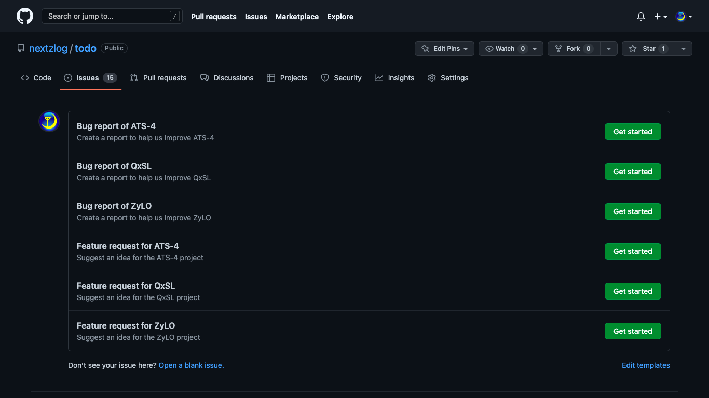

Forum of ATS-4 and ZyLO
====

[ATS-4](https://github.com/nextzlog/ats4)と[ZyLO](https://github.com/nextzlog/zylo)の利用者を支援する公式フォーラム

- 新機能の要望
- トラブル対応

自由に[投稿](https://github.com/nextzlog/todo/issues/new/choose)しましょう

## ATS-4

[ALLJA1コンテスト](https://allja1.org)や[電通大コンテスト](https://uectest.ja1zgp.com)の書類受付システム

## ZyLO

[zLog v2.8](https://zlog.org)以降に標準搭載されている[マーケットプレイス機能](https://zylo.pafelog.net)

## 報告手順

### 画面左上の**Issues**タブを開きます

### 画面右下の**New issue**ボタンを押します

### 話題を選び**Get started**ボタンを押します

### 要望や報告を書き込んで投稿します

## 連絡先

[@nextzlog](https://twitter.com/nextzlog)
